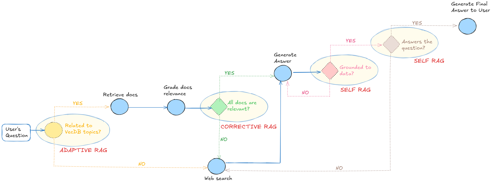
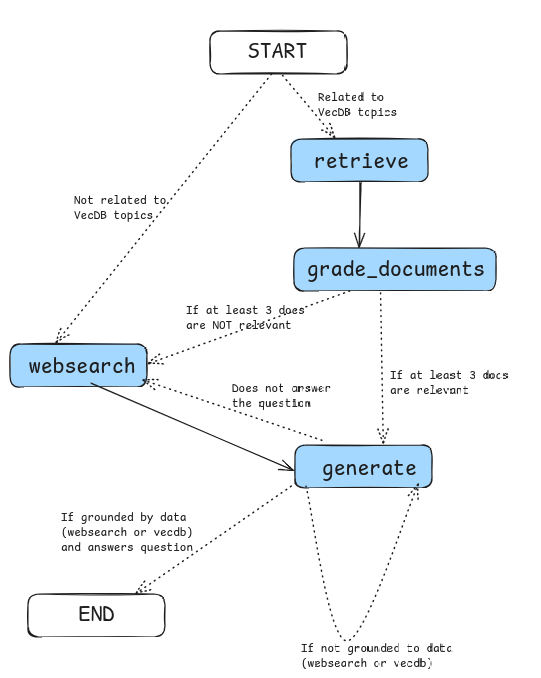

# Advanced RAG System with LangGraph🦜🕸️

An advanced Agentic RAG system implementing a multi-agent architecture with Adaptive, Corrective, and Self-RAG patterns for efficient document retrieval and question answering.

## System Overview

This system provides an intelligent documentation assistant for a Proof of Concept (POC) that leverages collaborative specialized agents to:
- Process and index AWS documentation with versioning control
- Deliver accurate, context-aware responses using advanced RAG patterns
- Provide source attribution and relevant document references
- Handle both in-vectorstore and web-based information retrieval
- Implement multi-agent verification to prevent hallucinations

<!--
## Video Explanation
The system features are explained in the following videos:
- [Ingestion Pipeline - DEV](https://www.loom.com/share/678ee0ba342942ff876ac2c23ee426ba?sid=c6789ae1-e089-4551-9fc0-2515d25ffdc7)
- [Retrieval DEV - part1](https://www.loom.com/share/7d36a1a9d4384781b7f821f00c8fbe4a?sid=7e58817b-0eab-4748-bf7d-ee91bc8a8585)
- [Retrieval DEV - part2 and AWS Considerations](https://www.loom.com/share/2f660ad268894a17a85d571e6aa3b42a?sid=0aae8bcf-a4db-40f0-8f37-1289672d2ebe)
-->
## Solution Design
### System Architecture


The architecture diagram shows the main components and data flow of the system, including the document ingestion pipeline, vector store, and the multi-agent RAG workflow.

### LangGraph Workflow


The graph visualization demonstrates the message passing and state transitions between specialized agents:
1. Router Agent: Decides between vectorstore and web search
2. Retrieval Agent: Gets relevant documents
3. Document Grading Agent: Evaluates document relevance
4. Web Search Agent: Augments knowledge by searching online when either:
   - Router determines question is not in VecDB context, then requires external data;
   - Document grading finds insufficient relevant context (< 3 docs);
   - Initial answer fails verification checks
5. Generation Agent: Produces final response
6. Verification Agents: Two-layer checking (fact and relevance)

## Key Features

#### 1. Intelligent Document Processing
- **Versioning Control**: Two-phase versioning detection using file timestamps and MD5 hashing of the page content.
- **Smart Chunking**: Token-aware text splitting with natural boundary preservation
- **Metadata Enrichment**: Automatic extraction of document attributes and relationships - possibility to expand to hybrid search in the future (Keyword/filter search + semantic search).
- **Change Detection**: Efficient handling of document updates and modifications, by implementing an upsert logic that prevents duplicates and stale data of files older versions.

#### 2. Advanced RAG Implementation
- **Adaptive Retrieval**: Dynamic switching between vectorstore and web search based on query context
- **Corrective-RAG**: Document relevance verification
  - Grades each retrieved document from the VecDB for relevance to the question
  - Requires minimum of 3 relevant documents
  - Triggers web search (2 attempts max) if insufficient relevant documents found, in order to improve the answer quality with more information.
- **Self-Verification**: Two-layer verification system:
  - Layer 1: Built-in fact-checking and hallucination prevention
  - Layer 2: Generated Answer relevance verification against original question
- **Source Attribution**: Automatic linking to source documentation
- **Multi-step Processing**: Question routing, retrieval, generation, and verification pipeline

#### 2.1 Multi-Agent Architecture
- **Collaborative Agents**: Specialized agents working together in a coordinated workflow:
  - Document Grading Agent: Evaluates document relevance (C-RAG)
  - Web Search Agent: Augments knowledge with online information
  - Generation Agent: Produces grounded responses using hub-optimized prompts
  - Verification Agents: Two-layer verification system
- **Agent Communication**: LangGraph-orchestrated message passing and state management
- **Agentic Decision Making**:
  - Autonomous routing between vectorstore and web search
  - Dynamic verification paths based on LLM-powered judges (`LLM-as-a-judge`):
    - Document relevance grading by retrieval_grader
    - Factual accuracy checking by hallucination_grader
    - Answer relevance verification by answer_grader

#### 3. Production-Ready Architecture
- **Modular Design**: Clear separation of concerns with independent components
- **Extensible Pipeline**: LangGraph-based workflow for easy modification - add new agents or change the order of execution
- **LLM Testing**: Basic Unit tests for core components
- **Performance Optimization**: 
  - Smart Updates:
    - Only processes changed documents using timestamp + hash checks
    - Deletes old chunks before adding new ones
    - Updates multiple documents at once
  - Memory Efficiency:
    - Processes documents in batches
      - Collects document IDs in lists for bulk operations
      - Performs batch deletions using ID lists
      - Groups document updates into single transactions 
    - Uses in-memory storage for development
    - SQLite storage for data persistence option for production

## Technical Specifications

### Vector Store Configuration
- **Engine**: ChromaDB
- **Embedding Model**: OpenAI Embeddings (default model: `text-embedding-3-small`, dim 1536 - same as `Amazon Titan Text Embeddings`)
- **Similarity Method**: Cosine similarity
- **Collection Name**: "public_data"

### Document Processing
- **Chunking Strategy**: RecursiveCharacterTextSplitter with tiktoken
- **Chunk Size**: 500 tokens
- **Overlap**: 50 tokens (10% overlap)
- **Split Hierarchy**: paragraphs → lines → sentences → clauses → words → chars

### RAG Pipeline Components
- **Query Router**: Context-aware routing between vectorstore and web search
- **Retriever**: Similarity-based document retrieval (k=7)
- **Generator**: Response generation with source grounding
  - **Generator Model**: `claude-3-5-sonnet-20240620`, same model available on `AWS Bedrock`
- **Verifier**: Multi-step verification for factual accuracy

## Project Structure
```bash
advanced-rag-agents/
├── graph/                      # Core RAG system components
│   ├── chains/                 # LLM chain definitions
│   │   ├── answer_grader_dev.py       # Grades final answer relevance
│   │   ├── hallucination_grader_dev.py # Checks for factual accuracy
│   │   ├── retrieval_grader_dev.py    # Grades document relevance
│   │   └── router_dev.py              # Routes questions to appropriate source
│   ├── nodes/                  # Graph node implementations
│   │   ├── generate_dev.py            # Response generation node
│   │   ├── grade_documents_dev.py     # Document grading node
│   │   ├── retrieve_dev.py            # Vector DB retrieval node
│   │   └── web_search_dev.py          # Web search augmentation node
│   ├── utils/                  # Utility functions
│   │   ├── ingestion_formatter.py     # Pretty printing for ingestion
│   │   └── output_formatter.py        # Pretty printing for RAG output
│   ├── consts_dev.py          # Graph constants and node names
│   ├── graph_dev.py           # Main graph definition and workflow
│   └── state_dev.py           # Shared graph state type definitions
├── public_data/               # Directory for markdown files to ingest
├── .chroma/                   # ChromaDB persistence directory
├── .env                       # Environment variables (use .env_template as base)
├── ingestion_dev.py          # Document processing and vectorstore updates
├── main_dev.py                # Retrieval and RAG pipeline for development and testing
├── main.py                   # Application entry point, run this to use the RAG system
├── poetry.toml                # Poetry configuration with project dependencies
├── pyproject.lock.toml        # Poetry lock file
└── README.md                 # Project documentation
```

## API Keys Required
- **ANTHROPIC_API_KEY**: For Claude 3.5 Sonnet (grading and generation)
- **OPENAI_API_KEY**: For embeddings model
- **TAVILY_API_KEY**: For web search capabilities
- **LANGCHAIN_API_KEY** (Optional): For tracing and monitoring with LangSmith

## Project Setup
1. Clone the repository
2. Install dependencies with Poetry:
   ```bash
   poetry install
   ```
3. Set up environment variables (use `.env_template` as base):
   ```bash
   ANTHROPIC_API_KEY=your_key_here
   OPENAI_API_KEY=your_key_here
   TAVILY_API_KEY=your_key_here
   ANTHROPIC_MODEL=claude-3-sonnet-20240320
   LANGCHAIN_API_KEY=your_key_here  # Optional: For tracing with LangSmith
   ```
4. Run the application:
   ```bash
   poetry run python main.py
   ```
   
### The main application performs two key functions:

1. **Document Ingestion**: First checks the `public_data` directory for new or modified markdown files. If changes are detected, it prompts the user to run the ingestion pipeline. When approved by the user, it uses a two-phase versioning system (timestamp + MD5 hash) to efficiently process only changed documents, updating the ChromaDB vector store with properly chunked and embedded content. Each document is split into 500-token chunks with 10% overlap for optimal retrieval.

2. **Interactive Question Answering**: After ingestion, it starts an interactive CLI where the user can:
   - Enter questions (type 'quit' to exit)
   - Get responses through the RAG pipeline that:
     - Routes questions between vectorstore and web search
     - Retrieves and grades relevant documents (minimum 3 required)
     - Generates answers using Claude 3.5 Sonnet
     - Verifies responses through a two-layer fact-checking system
     - Provides source attribution for all answers

All operations are logged to `rag_system.log` for monitoring and debugging.

